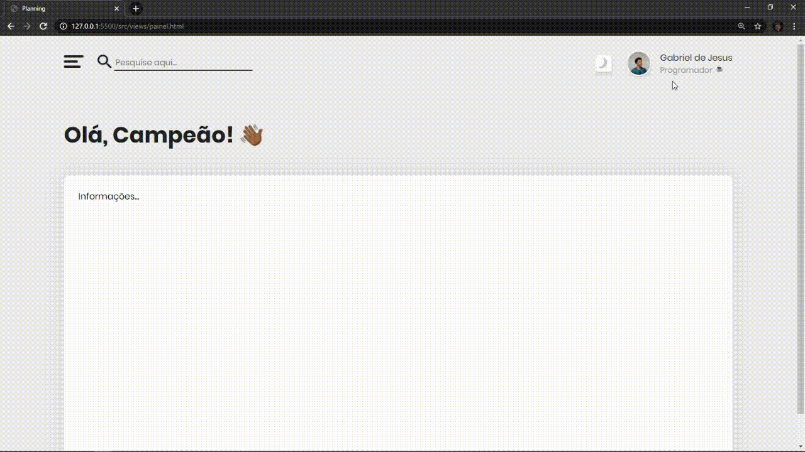

# Project: Planning

> Make notes, plan projects and always have an organized and motivational calendar on hand.

> Web preview

## Release history

* 0.0.1
    * Work in `progress`

## Meta

Gabriel de Jesus – [My portfolio](https://www.gabrieldesenvolvedor.com) – contato@gabrieldesenvolvedor.com

Distributed under the MIT License. See `LICENSE` for more information.

[https://github.com/devgabrieldejesus/planning](https://github.com/devgabrieldejesus/)

## Contributing

1. Fork it (<https://github.com/devgabrieldejesus/planning/fork>)
2. Create your feature branch (`git checkout -b feature/fooBar`)
3. Commit your changes (`git commit -am 'Add some fooBar'`)
4. Push to the branch (`git push origin feature/fooBar`)
5. Create a new Pull Request
